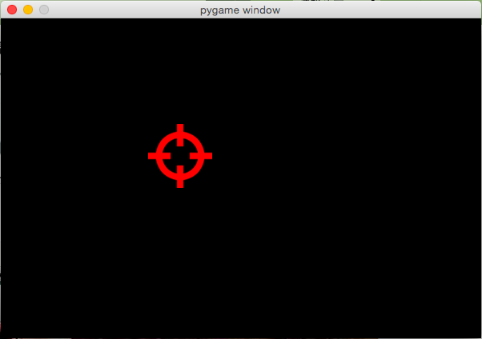

# 改变鼠标的样式

效果


实现代码
```
import pygame

pygame.init()
resolution = (width, height) = (600, 400)
screen = pygame.display.set_mode(resolution)
clock = pygame.time.Clock()
pygame.mouse.set_visible(False) # 隐藏原来的鼠标

miraimg = pygame.image.load("mira.png") # 新鼠标图片
mirarect = miraimg.get_rect()

while True:
    clock.tick(60)
    screen.fill(0)
    for event in pygame.event.get():
        if event.type == pygame.QUIT:
            pygame.quit()
            exit(0)
        mousepos = pygame.mouse.get_pos()
        mirarect.centerx = mousepos[0]
        mirarect.centery = mousepos[1]
    screen.blit(miraimg, mirarect)
    pygame.display.flip()
```
